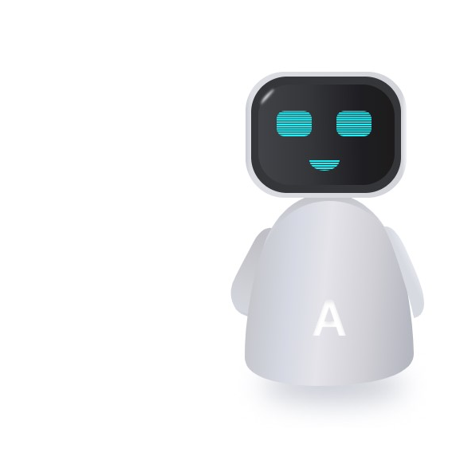
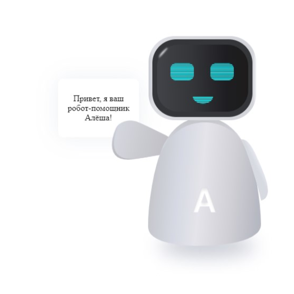
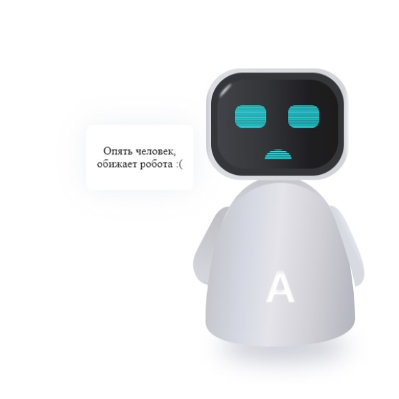

# Animated robot
<a href="https://viktorcoi.github.io/animated-robot/">Click here to view the git page online</a>
An animated robot written using html / scss / jQuery can follow your cursor with its eyes and react to page scrolling, clicking and hovering over it.
 
Online example: 
- jQuery functionality;
- Styled scss preprocessor;
- BEM methodology was used for layout;

## Screenshots
<table width="100" align="center">
    <td align="center">
        
    </td>
    <td align="center">
        
    </td>
    <td align="center">
        
    </td>
</table>
